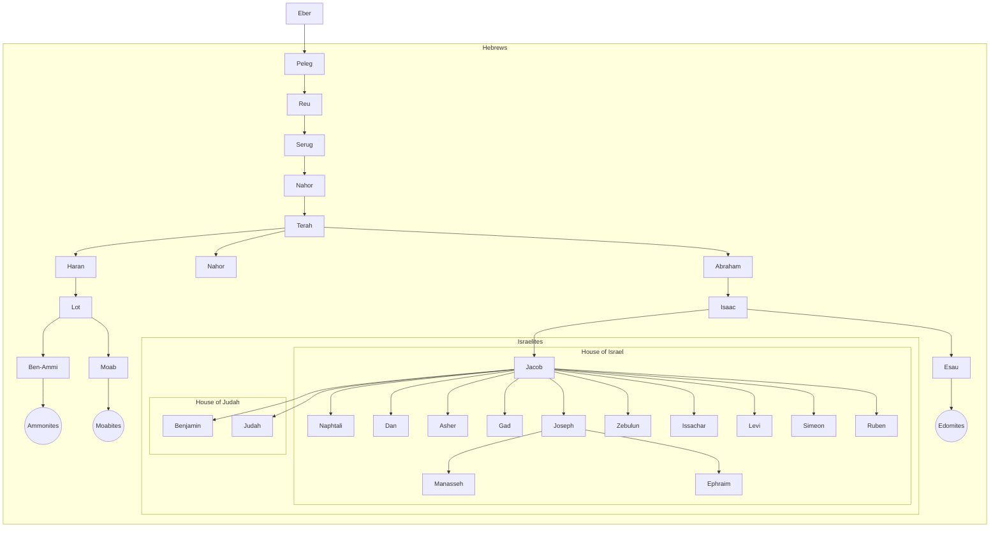
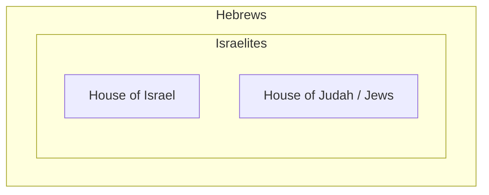

import { Callout } from "nextra/components";
import { BibleVerse } from "components/bibleVerse";

# Who are the Hebrews?

The term Hebrew is believed to be the children of Eber, who was the great-great-great-great-grandfather of Abram (Abraham):

<BibleVerse
  data={{
    reference: "Genesis 11:16-26",
    verses: [
      {
        book_id: "GEN",
        book_name: "Genesis",
        chapter: 11,
        verse: 16,
        text: "And Eber lived four and thirty years, and begat Peleg:\n",
      },
      {
        book_id: "GEN",
        book_name: "Genesis",
        chapter: 11,
        verse: 17,
        text: "And Eber lived after he begat Peleg four hundred and thirty years, and begat sons and daughters.\n",
      },
      {
        book_id: "GEN",
        book_name: "Genesis",
        chapter: 11,
        verse: 18,
        text: "And Peleg lived thirty years, and begat Reu:\n",
      },
      {
        book_id: "GEN",
        book_name: "Genesis",
        chapter: 11,
        verse: 19,
        text: "And Peleg lived after he begat Reu two hundred and nine years, and begat sons and daughters.\n",
      },
      {
        book_id: "GEN",
        book_name: "Genesis",
        chapter: 11,
        verse: 20,
        text: "And Reu lived two and thirty years, and begat Serug:\n",
      },
      {
        book_id: "GEN",
        book_name: "Genesis",
        chapter: 11,
        verse: 21,
        text: "And Reu lived after he begat Serug two hundred and seven years, and begat sons and daughters.\n",
      },
      {
        book_id: "GEN",
        book_name: "Genesis",
        chapter: 11,
        verse: 22,
        text: "And Serug lived thirty years, and begat Nahor:\n",
      },
      {
        book_id: "GEN",
        book_name: "Genesis",
        chapter: 11,
        verse: 23,
        text: "And Serug lived after he begat Nahor two hundred years, and begat sons and daughters.\n",
      },
      {
        book_id: "GEN",
        book_name: "Genesis",
        chapter: 11,
        verse: 24,
        text: "And Nahor lived nine and twenty years, and begat Terah:\n",
      },
      {
        book_id: "GEN",
        book_name: "Genesis",
        chapter: 11,
        verse: 25,
        text: "And Nahor lived after he begat Terah an hundred and nineteen years, and begat sons and daughters.\n",
      },
      {
        book_id: "GEN",
        book_name: "Genesis",
        chapter: 11,
        verse: 26,
        text: "And Terah lived seventy years, and begat Abram, Nahor, and Haran.\n",
      },
    ],
    text: "And Eber lived four and thirty years, and begat Peleg:\nAnd Eber lived after he begat Peleg four hundred and thirty years, and begat sons and daughters.\nAnd Peleg lived thirty years, and begat Reu:\nAnd Peleg lived after he begat Reu two hundred and nine years, and begat sons and daughters.\nAnd Reu lived two and thirty years, and begat Serug:\nAnd Reu lived after he begat Serug two hundred and seven years, and begat sons and daughters.\nAnd Serug lived thirty years, and begat Nahor:\nAnd Serug lived after he begat Nahor two hundred years, and begat sons and daughters.\nAnd Nahor lived nine and twenty years, and begat Terah:\nAnd Nahor lived after he begat Terah an hundred and nineteen years, and begat sons and daughters.\nAnd Terah lived seventy years, and begat Abram, Nahor, and Haran.\n",
    translation_id: "kjv",
    translation_name: "King James Version",
    translation_note: "Public Domain",
  }}
/>

<Callout type="info">
  Israelites are Hebrews, but not all Hebrews are Israelites. For example: Esau
  and his descendants are Hebrews, but only Jacob's descendants are Israelites.
</Callout>

