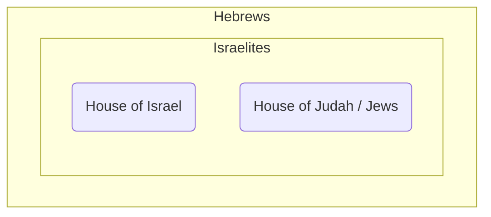

import { Callout } from "nextra/components";
import { BibleVerse } from "../../components/bibleVerse";

# Who are the Hebrews?

The term Hebrew is believed to be the children of Eber, who was the great-great-great-great-grandfather of Abram (Abraham):

> 16 When Eber had lived 34 years, he fathered Peleg. 17 And Eber lived after he fathered Peleg 430 years and had other sons and daughters.
> 18 When Peleg had lived 30 years, he fathered Reu. 19 And Peleg lived after he fathered Reu 209 years and had other sons and daughters.
> 20 When Reu had lived 32 years, he fathered Serug. 21 And Reu lived after he fathered Serug 207 years and had other sons and daughters.
> 22 When Serug had lived 30 years, he fathered Nahor. 23 And Serug lived after he fathered Nahor 200 years and had other sons and daughters.
> 24 When Nahor had lived 29 years, he fathered Terah. 25 And Nahor lived after he fathered Terah 119 years and had other sons and daughters.
> 26 When Terah had lived 70 years, he fathered Abram, Nahor, and Haran.
>
> -- The Holy Bible: English Standard Version (Wheaton, IL: Crossway Bibles, 2016), Ge 11:16–26.

##

<Callout type="info">
  Israelites are Hebrews, but not all Hebrews are Israelites. For example: Esau
  and his descendants are Hebrews, but only Jacob's descendants are Israelites.
</Callout>

{/* <BibleVerse /> */}
